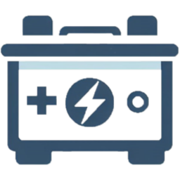
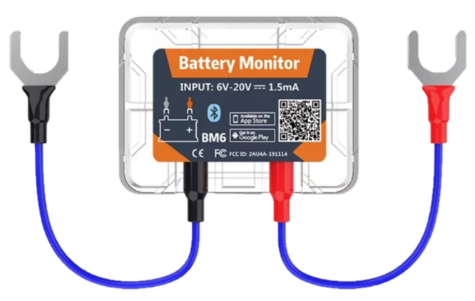
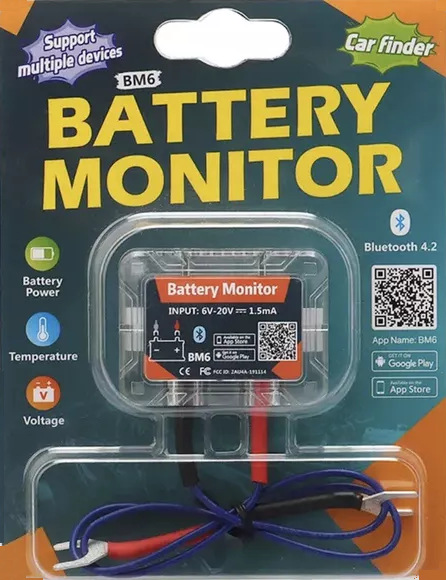
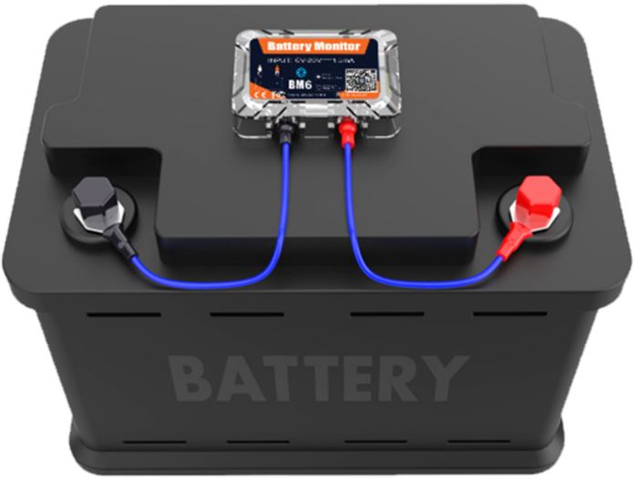

# Battery Monitor BM6 Integration
  

[![GitHub release (latest by date)][release-badge]][release-link] [![GitHub][license-badge]][license-link] [![hacs_badge][hacs-badge]][hacs-link] [![GitHub stars][stars-badge]][stars-link] ![GitHub][maintained-badge] [![GitHub issues][issues-badge]][issues-link] [![GitHub commits since latest release (by SemVer)][commits-badge]][commits-link]

This custom component for [Home Assistant](https://www.home-assistant.io) reads BLE Car Battery Monitor BM6.

**:warning: IMPORTANT! Coming soon available**

## Integration
This is an integration that allows you to observe BM6 parameters on the Home Assistant platform. BM6 is monitored via a Bluetooth gateway, and its parameters such as temperature, voltage, percent, state are saved as entities by the HA platform.

This integration allows you to add any number of such devices.

Warning! The author is not responsible for any damages related to the use of this integration. You use this integration at your own risk and responsibility.
## Configuration
### Battery Voltage supported
- 6 Volts
- 12 Volts
- Custom from device voltage 6-20V
### Battery Types supported
- Flooded Lead-Acid (**FLA**)
- Absorbent Glass Mat (**AGM**)
- Gel Cell (**GEL**)
- Nickel-Cadmium (**NiCd**)
- Nickel-Metal Hydride (**NiMH**)
- Lithium-Ion (**Li-Ion**)
- Lithium Iron Phosphate (**LiFePO4**)
- Lithium Titanate (**LTO**)
- Custom Battery - defined by user.
### Battery States and Percentage
#### Algorithms of battery status
To calculate percentage of battery power and actual state, integration use algorithm configured by user.
- Calculated by BM6 Device (integration get information from BM6 device)
- Calculated using State of Charge/Discharge (SoC/SoD)
- Calculated using Charge/Discharge Voltage Range (CVR/DVR)
#### States of battery
Each BM6 device have one calculated sensor presents actual battery state. It can take one of these values. Availability of this states is depending of used algorithms.
| State name    | From BM6 | Calculated | Description                                                                 |
|---------------|:--------:|:----------:|-----------------------------------------------------------------------------|
| Ok            |    X     |            | Battery state Ok (1)                                                        |
| Low Voltage   |    X     |            | Low voltage (1)                                                             |
| Under Voltage |          |     X      | Voltage is under minimum of SoD or DVR                                      |
| Discharging   |          |     X      | Charging process, voltage is between minimum and maximum of SoD or DVR      |
| Idle          |          |     X      | Idle state, voltage is between maximum SoD or DVR and minimum of SoC or CVR |
| Charging      |    X     |     X      | Charging process, voltage is between minimum and maximum of SoC or CVR      |
| Over Voltage  |          |     X      | Voltage is over maximum of SoC or CVR                                       |
 (1) - Only the BM6 manufacturer knows the details
## Integration Sensors
- Sensor 'Temperature' it presents temperature measure by BM6 device. Value can by calibrated at integration configuration time.
- Sensor 'Voltage' it presents battery voltage measure by BM6 device. Value can by calibrated too.
- Sensor 'State' calculates the hypothetical battery state from the actual device voltage. Calculation can use parameters of battery configuration or can be get directly from BM6 device.
- Sensor 'Percent' calculates the hypothetical charge or discharge percentage of the battery using one of these algorithms
## Diagnostic Sensors
- Sensor 'Signal Strength (RSSI)' - signal strength reported by Bluetooth gateway.
- Sensor 'Percentage by device' - percentage value reported directly from BM6 device.
- Sensor 'State by device' - battery state reported directly from BM6 device. Only 'Ok', 'Low Voltage' and 'Charging'.
## Triggers
Triggers availability is depending on choose algorithm at configuration time. Their behavior corresponds to the change of the value 'State' sensor.
| Name                      | From BM6 | Calculated |
|---------------------------|:--------:|:----------:|
| Started OK state          |    X     |            |
| Started Low Voltage state |    X     |            |
| Under Voltage             |          |     X      |
| Started Discharging       |          |     X      |
| Started Idle              |          |     X      |
| Started Charging          |    X     |     X      |
| Over Voltage              |          |     X      |
| State Changed             |    X     |     X      |
## Device Hardware BM6
The Battery Monitor BM6 is a device designed to help you keep track of your car battery's health and performance. Here are some key features:
- **Real-time Voltage Monitoring**: It allows you to monitor the voltage of your car battery in real-time.
- **Battery Testing**: You can test the starting and charging system voltage to ensure your battery is functioning properly.
- **Data Logging**: The device can accurately record the time of car starting and stopping, and all data can be displayed on your mobile phone via Bluetooth.
- **Compatibility**: The BM6 is compatible with most 12V car batteries and can be easily installed in your vehicle.
- **Bluetooth Connectivity**: It connects to your smartphone via Bluetooth, allowing you to monitor your battery's health and performance in real-time.

Battery Monitor BM6 is also available under other names:
- Sealey BT2020 Battery Monitor
- ANCEL BM200 Car Battery Tester
- QUICKLYNKS Battery Monitor BM6
## Installation
You must have [HACS](https://hacs.xyz/) integration installed first. 
Select 'HACS' (usual on the left bar), add then choose from menu 'Custom repositories' (on top at right). Put the address https://github.com/Rafciq/BM6 at first and select repository type 'Integration' choose 'ADD'. Now you can add BM6 devices.
## Configuration
Go to "Settings', next 'Devices & services', select 'Integration' and use 'ADD INTEGRATION'
## Languages
-  Albanian
-  Croatian
-  Czech
-  Danish
-  Dutch
-  English 
-  Finnish
-  French
-  German
-  Greek
-  Hungarian
-  Icelandic
-  Irish
-  Italian
-  Latvian
-  Lithuanian
-  Macedonian
-  Maltese
-  Norwegian
-  Polish
-  Portuguese
-  Romanian
-  Serbian
-  Slovak
-  Slovenian
-  Spanish
-  Swedish
-  Turkish
-  Ukrainian
# Thanks
This project is inspired and based on the hard work of other people and their publications:
- [Reverse Engineering the BM6 BLE Battery Monitor](https://www.tarball.ca/posts/reverse-engineering-the-bm6-ble-battery-monitor/)
- [bm6-battery-monitor](https://github.com/jeffwdh/bm6-battery-monitor)
- [bm2-battery-monitor](https://github.com/KrystianD/bm2-battery-monitor/blob/master/.docs/reverse_engineering.md)
- [BM2: Reversing the BLE Protocol of the BM2 Battery Monitor](https://doubleagent.net/bm2-reversing-the-ble-protocol-of-the-bm2-battery-monitor/)
# Batteries information
## Types of batteries:
### Lead-Acid Batteries:
#### Flooded Lead-Acid Battery: FLA
| Battery Type | DVR         | CVR         | SoD         | SoC         |
|--------------|-------------|-------------|-------------|-------------|
| 6V           | 5.8-6.3V    | 6.8-7.2V    | 5.8-6.0V    | 6.0-6.3V    |
| 12V          | 10.5-12.7V  | 13.8-14.4V  | 10.5-12.0V  | 12.0-12.7V  |
#### Sealed Lead-Acid Battery (VRLA):
##### Absorbent Glass Mat: AGM
| Battery Type | DVR         | CVR         | SoD         | SoC         |
|--------------|-------------|-------------|-------------|-------------|
| 6V           | 5.8-6.3V    | 6.8-7.2V    | 5.8-6.0V    | 6.0-6.3V    |
| 12V          | 10.5-12.6V  | 14.4-14.7V  | 10.5-12.0V  | 12.0-12.6V  |
##### Gel Cell: Gel
| Battery Type | DVR         | CVR         | SoD         | SoC         |
|--------------|-------------|-------------|-------------|-------------|
| 6V           | 5.8-6.3V    | 6.8-7.2V    | 5.8-6.0V    | 6.0-6.3V    |
| 12V          | 10.5-12.6V  | 13.8-14.4V  | 10.5-12.0V  | 12.0-12.6V  |
### Nickel-Based Batteries
#### Nickel-Cadmium: NiCd
| Battery Type | DVR         | CVR         | SoD         | SoC         |
|--------------|-------------|-------------|-------------|-------------|
| 6V           | 5.4-6.0V    | 6.8-7.2V    | 5.4-5.8V    | 5.8-6.0V    |
| 12V          | 10.8-12.0V  | 13.6-14.4V  | 10.8-11.5V  | 11.5-12.0V  |
#### Nickel-Metal Hydride: NiMH
| Battery Type | DVR         | CVR         | SoD         | SoC         |
|--------------|-------------|-------------|-------------|-------------|
| 6V           | 5.4-6.0V    | 6.8-7.2V    | 5.4-5.8V    | 5.8-6.0V    |
| 12V          | 10.8-12.0V  | 13.6-14.4V  | 10.8-11.5V  | 11.5-12.0V  |
### Lithium-Based Batteries
#### Lithium-Ion: Li-Ion
| Battery Type | DVR         | CVR         | SoD         | SoC         |
|--------------|-------------|-------------|-------------|-------------|
| 6V           | 6.0-7.2V    | 7.0-7.2V    | 6.0-6.5V    | 6.5-7.2V    |
| 12V          | 10.0-13.5V  | 14.4-14.6V  | 10.0-12.0V  | 12.0-13.5V  |
#### Lithium Iron Phosphate: LiFePO4
| Battery Type | DVR         | CVR         | SoD         | SoC         |
|--------------|-------------|-------------|-------------|-------------|
| 12V          | 12.0-13.5V  | 14.6-15.0V  | 12.0-13.0V  | 13.0-13.5V  |
#### Lithium Titanate: LTO
| Battery Type | DVR         | CVR         | SoD         | SoC         |
|--------------|-------------|-------------|-------------|-------------|
| 6V           | 5.4-6.6V    | 6.0-6.6V    | 5.4-6.0V    | 6.0-6.6V    |
| 12V          | 10.8-13.2V  | 12.0-13.2V  | 10.8-12.0V  | 12.0-13.2V  |
## Shortcuts of battery process states:
- DVR = Discharging Voltage Range
- CVR = Charging Voltage Range
- SoC = State of Charge
- SoD = State of Discharge

## Images of Device

